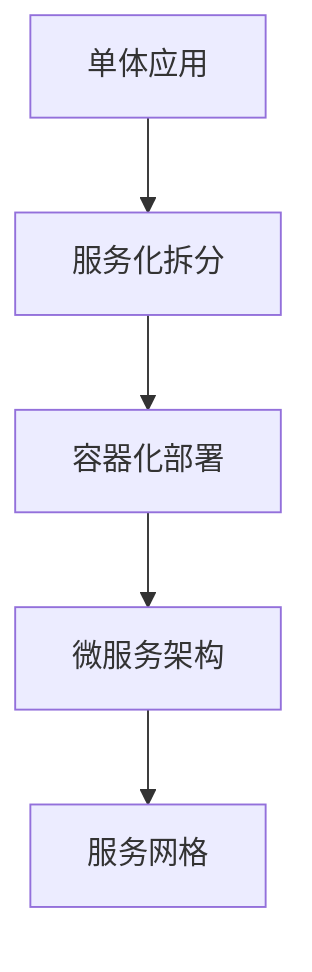

# 分布式系统设计模式实战：从理论到实践

> 基于《Designing Distributed Systems》的实践探索，通过实际代码演示分布式系统设计的核心概念

## 引言

随着云计算和微服务架构的普及，分布式系统已经成为现代软件架构的主流选择。然而，设计和实现一个可靠、可扩展的分布式系统并非易事。本文将基于经典的分布式系统设计模式，通过实际的代码示例和容器化部署，为您展示如何构建健壮的分布式系统。

## 为什么需要分布式系统设计模式？

传统的单体应用在面对高并发、大数据量和复杂业务逻辑时往往力不从心。分布式系统设计模式提供了一系列经过验证的解决方案，帮助我们：

- **提高系统可用性**: 通过冗余和故障转移机制
- **增强系统扩展性**: 水平扩展替代垂直扩展
- **优化资源利用**: 按需分配和弹性伸缩
- **简化系统复杂性**: 通过模块化和服务化

## 核心设计模式解析

### 1. 单节点模式 (Single-Node Patterns)

#### 边车模式 (Sidecar Pattern)

边车模式是将应用程序的辅助功能部署在单独的容器中的设计模式，就像摩托车的边车一样为主容器提供支持。

**核心优势：**
- 关注点分离：主应用专注业务逻辑
- 技术栈独立：不同容器可使用不同技术
- 可复用性：边车容器可在多个应用间复用

**实际应用场景：**
```python
# 主应用 - 业务逻辑
@app.route('/api/users', methods=['GET'])
def get_users():
    # 业务处理
    logger.info(f"Users list requested, returning {len(users)} users")
    return jsonify({"users": users})

# 边车容器 - 监控和日志
class SidecarMonitor:
    def collect_logs(self):
        # 监控日志文件变化
        with open(self.log_file_path, 'r') as f:
            for line in f:
                self.process_log_line(line)
```

在我们的演示中，边车容器负责：
- 日志收集和处理
- 性能指标监控
- 健康状况检查
- 配置管理

### 2. 服务模式 (Serving Patterns)

#### 负载均衡器模式

负载均衡器是分布式系统中的关键组件，用于在多个后端服务实例之间分发网络流量。

**负载均衡策略：**
- **轮询 (Round Robin)**: 按顺序分发请求
- **加权轮询**: 根据服务器性能分配权重
- **最少连接**: 优先选择连接数最少的服务器
- **IP Hash**: 基于客户端IP确保会话粘性

**Nginx配置示例：**
```nginx
upstream backend_servers {
    server backend1:8000 weight=1 max_fails=3 fail_timeout=30s;
    server backend2:8000 weight=1 max_fails=3 fail_timeout=30s;
    server backend3:8000 weight=1 max_fails=3 fail_timeout=30s;
}

server {
    listen 80;
    location / {
        proxy_pass http://backend_servers;
        proxy_set_header X-Real-IP $remote_addr;
        proxy_set_header X-Forwarded-For $proxy_add_x_forwarded_for;
    }
}
```

### 3. 通信模式 (Communication Patterns)

#### 消息队列模式

消息队列实现了系统组件间的异步通信，是构建可扩展分布式系统的基础设施。

**核心优势：**
- **解耦**: 生产者和消费者独立演进
- **异步处理**: 提高系统响应速度
- **削峰填谷**: 平滑流量波动
- **可靠性**: 消息持久化防止丢失

**实现示例：**
```python
# 消息生产者
class MessageProducer:
    def send_message(self, queue_name, message_data, priority=0):
        message = {
            'id': str(uuid.uuid4()),
            'timestamp': datetime.now().isoformat(),
            'data': message_data,
            'priority': priority
        }
        
        if priority > 0:
            self.redis.lpush(queue_name, json.dumps(message))
        else:
            self.redis.rpush(queue_name, json.dumps(message))

# 消息消费者
class MessageConsumer:
    def consume_messages(self, queue_names):
        while self.running:
            result = self.redis.blpop(queue_names, timeout=1)
            if result:
                queue_name, message_json = result
                self.process_message(queue_name, message_json)
```

## 容器化部署与编排

### Docker Compose 编排

使用Docker Compose可以轻松管理多容器应用：

```yaml
version: '3.8'
services:
  nginx:
    image: nginx:alpine
    ports:
      - "80:80"
    depends_on:
      - backend1
      - backend2
      - backend3
  
  backend1:
    build: .
    environment:
      - SERVER_ID=backend-1
```

### 监控和可观察性

完整的分布式系统需要全面的监控：

```python
@app.route('/metrics', methods=['GET'])
def metrics():
    return f"""
# HELP requests_total Total number of requests
requests_total{{server_id="{SERVER_ID}"}} {request_count}

# HELP current_load Current server load  
current_load{{server_id="{SERVER_ID}"}} {server_load}
""", 200, {'Content-Type': 'text/plain'}
```

## 实践经验总结

### 设计原则

1. **单一职责**: 每个组件只负责一个特定功能
2. **松耦合**: 组件间通过明确的接口通信
3. **高内聚**: 相关功能组织在同一模块内
4. **容错性**: 设计时考虑组件故障情况

### 常见陷阱

1. **过度设计**: 不要为了模式而模式
2. **状态管理**: 合理设计有状态和无状态组件
3. **网络分区**: 考虑CAP理论的权衡
4. **监控盲点**: 确保系统各层面都有监控

### 性能优化

1. **缓存策略**: 多层缓存提升响应速度
2. **连接池**: 复用数据库和网络连接
3. **异步处理**: 使用消息队列处理耗时任务
4. **资源隔离**: 防止资源争用影响系统稳定性

## 扩展和演进

### 从单体到分布式



### 技术栈演进

- **容器编排**: Docker → Docker Compose → Kubernetes
- **服务发现**: 静态配置 → 动态注册 → 服务网格
- **监控体系**: 日志 → 指标 → 链路追踪
- **部署方式**: 手动部署 → CI/CD → GitOps

## 总结

分布式系统设计模式为我们提供了构建复杂系统的有效工具。通过理解和实践这些模式，我们可以：

- 构建更加可靠和可扩展的系统
- 提高开发效率和代码质量  
- 降低系统维护成本
- 更好地应对业务增长需求

本文展示的代码示例都可以在 [GitHub仓库](https://github.com/your-repo/distributed-systems-demo) 中找到，包含完整的部署脚本和文档。

## 参考资料

1. 《Designing Distributed Systems》- Brendan Burns
2. 《Building Microservices》- Sam Newman  
3. 《Kubernetes in Action》- Marko Lukša
4. [Cloud Native Computing Foundation](https://www.cncf.io/)
5. [The Twelve-Factor App](https://12factor.net/)

---

**关于作者**

专注于云原生和分布式系统架构设计，对容器化技术和微服务架构有深入研究。欢迎交流讨论！

**标签**: `分布式系统` `容器化` `微服务` `负载均衡` `消息队列` `Docker` `Kubernetes`
